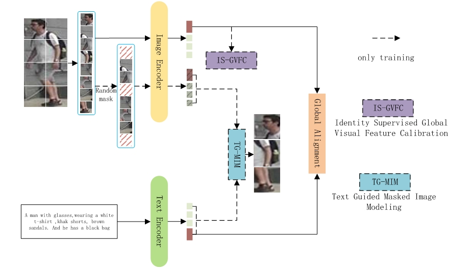

# VFE_TPS
Code for our paper "Enhancing Visual Representation for Text-based Person Searching"

## Model Overview


## Usage
### Requirements
we use single Nvidia RTX 3090 GPU (24G) for training and testing
```
PyTorch 2.0.0
torchvision 0.15.0
easydict
tqdm
prettytable
```
 ### Prepare Datasets
 The CUHK-PEDES dataset is proposed by the paper "Person Search with Natural Language Description" (Shuang Li, et al.) and can be downloaded from [here](https://github.com/ShuangLI59/Person-Search-with-Natural-Language-Description). ICFG-PEDES dataset can be found [here](https://github.com/zifyloo/SSAN) and RSTPReid dataset is [here](https://github.com/NjtechCVLab/RSTPReid-Dataset).
 ```
|-- your dataset root dir/
|   |-- <CUHK-PEDES>/
|       |-- imgs
|            |-- cam_a
|            |-- cam_b
|            |-- ...
|       |-- reid_raw.json
|
|   |-- <ICFG-PEDES>/
|       |-- imgs
|            |-- test
|            |-- train 
|       |-- ICFG_PEDES.json
|
|   |-- <RSTPReid>/
|       |-- imgs
|       |-- data_captions.json
```

### Training
Directly run "fun.sh" file 

### Testing
```
python test.py
```

## Results
### Results on CUHK-PEDES dataset

### Results on ICFG-PEDES dataset

### Results on RSTPReid dataset
